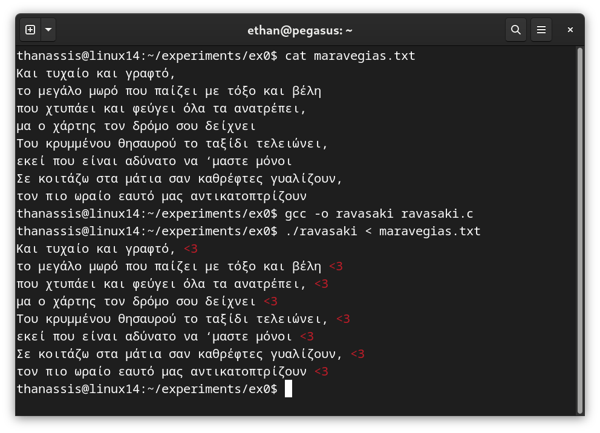

# Τελική Εξέταση #0 - Valentine's Themed

Σημαντικό: φροντίζουμε τα προγράμματά μας αν είναι ευανάγνωστα, αποδοτικά (σε χώρο και χρόνο) και να έχουν έξοδο όμοια με τα παραδείγματα εκτέλεσης καθώς αυτό είναι μέρος της βαθμολόγησης. Για οποιαδήποτε είσοδο εκτός προδιαγραφών το πρόγραμμα πρέπει να τερματίζει με exit code 1 και αντίστοιχο μήνυμα σφάλματος.


## 1. Ραβασάκι (25 Μονάδες)

### Πρόγραμμα: ravasaki.c

Γράψτε ένα πρόγραμμα που διαβάζει το κείμενο που δίνεται από την πρότυπη είσοδο (stdin) και το τυπώνει στην πρότυπη έξοδο (stdout) προσθέτοντας μια κόκκινη καρδιά στο τέλος κάθε γραμμής. Παράδειγμα εκτέλεσης:



## 2. Ταιριαστές Καρδιές (25 Μονάδες)

### Πρόγραμμα: hearts.c

Γράψτε ένα πρόγραμμα που για κάθε όρισμα από την γραμμή εντολών ελέγχει αν η συμβολοακολουθία του ορίσματος περιέχει μόνο *ταιριαστές* καρδιές. Οι ταιριαστές καρδιές ορίζονται ως εξής:

1. Μπορούν να περιέχουν μόνο χαρακτήρες '<' και '3'.
1. Κάθε καρδιά που κλείνει ('3') πρέπει πρώτα να έχει ανοίξει ('<').
1. Όλες οι καρδιές που άνοιξαν κλείνουν.

Παράδειγμα εκτέλεσης:

```bash
$ gcc -o hearts hearts.c
$ ./hearts '<3' '<.3>' '<<33' '<<<3' '<333' '<<33<3<<<<3<<33333'
<3: yes
<.3>: no
<<33: yes
<<<3: no
<333: no
<<33<3<<<<3<<33333: yes
```

## 3. Καλύτερο Ταίριασμα (25 Μονάδες)

### Πρόγραμμα: bestmatch.c

Γράψτε ένα πρόγραμμα που διαβάζει ένα σύνολο από ονόματα ακολουθούμενα από έναν αριθμό που δηλώνει πόσο καλά μας ταιριάζει αυτό το άτομο και τυπώνει τα ονόματα από το μεγαλύτερο στο μικρότερο ταξινομημένα. Τα δεδομένα περιέχονται σε αρχείο που δίνεται ως πρώτο όρισμα. Το αρχείο θα περιέχει κάθε όνομα σε μια γραμμή της μορφής "όνομα,σκορ". Ένα παράδειγμα εκτέλεσης ακολουθεί:

```bash
$ cat names.txt
Alex,3.4
Casey,9.1
Jordan,2
Taylor,5.3
Morgan,1.7
Riley Avery,6.16
Jamie,0
Quinn,-1.1
Skyler,5.88
$ gcc -o bestmatch bestmatch.c
$ ./bestmatch names.txt
Casey,9.1
Riley Avery,6.16
Skyler,5.88
Taylor,5.3
Alex,3.4
Jordan,2
Morgan,1.7
Jamie,0
Quinn,-1.1
```

## 4. Αγαπήσιμοι Αριθμοί (25 Μονάδες)

### Πρόγραμμα: lovable.c

Γράψτε ένα πρόγραμμα που διαβάζει ένα εύρος αριθμών από την κονσόλα (το εύρος είναι κλειστό, δηλαδή περιέχει τα όρια) και τυπώνει όλους τους αγαπήσιμους (lovable) αριθμούς. Ένας αριθμός είναι lovable αν είναι τέλειος κύβος (δηλαδή ένας άλλος ακέραιος υψωμένος στην 3η δύναμη) και ταυτόχρονα παλινδρομικός (δηλαδή διαβάζεται το ίδιο από αριστερά προς τα δεξιά και από δεξιά προς τα αριστερά). Ένα παράδειγμα εκτέλεσης ακολουθεί:

```bash
$ gcc -o lovable lovable.c -lm
$ ./lovable 100000 100000000
1030301
1367631
```

Ο 1030301 είναι lovable καθώς είναι παλινδρομικός και ταυτόχρονα τέλειος κύβος (= 101^3). Το πρόγραμμά σας πρέπει να βγάζει σωστά αποτελέσματα για όρια μέχρι 10^18.
