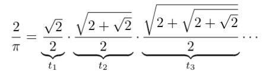

# Τελική Εξέταση #13 - Soccer :four_leaf_clover: Themed

Σημαντικό: φροντίζουμε τα προγράμματά μας να είναι ευανάγνωστα, αποδοτικά (σε χώρο και χρόνο) και να έχουν έξοδο όμοια με τα παραδείγματα εκτέλεσης καθώς αυτό είναι μέρος της βαθμολόγησης. Για οποιαδήποτε είσοδο εκτός προδιαγραφών το πρόγραμμα πρέπει να τερματίζει με exit code 1 και αντίστοιχο μήνυμα σφάλματος.

## 1. Κάντο όπως ο Βιετά (25 Μονάδες)

### Πρόγραμμα: vieta.c

Ο Γάλλος μαθηματικός Βιετά (Francois Viete) υπήρξε ο πρώτος μαθηματικός που χρησιμοποίησε ευρέως σύμβολα για να εκφράσει αριθμητικές ποσότητες. Το 1593 κατάφερε να εκφράσει και να υπολογίσει τον αριθμό $\pi$ με ακρίβεια 9 δεκαδικών, βελτιώνοντας έτσι το σχετικό αποτέλεσμα του Αρχιμήδη. Για να υπολογίσει το $\pi$, ο Βιετά χρησιμοποίησε μια σχέση που χρησιμοποιεί ένα απειρογινόμενο όρων $t_i$, γνωστό ως φόρμουλα Βιετά προς τιμήν του:



Λύνοντας την παραπάνω σχέση ως προς $\pi$, μπορούμε και εμείς να προσεγγίσουμε το $\pi$ όπως ο Βιετά. Μάλιστα, όσους περισσότερους όρους $t_i$ χρησιμοποιούμε, τόσο καλύτερη η προσέγγισή μας. Γράψτε ένα πρόγραμμα C το οποίο παίρνει έναν θετικό ακέραιο ως όρισμα από την γραμμή εντολών που αντιπροσωπεύει πόσους πρώτους όρους $t_i$ να χρησιμοποιήσει στον υπολογισμό του $\pi$ και στην συνέχεια εκτυπώνει την προσέγγιση του $\pi$ με 9 δεκαδικά ψηφία. Παραδείγματα εκτέλεσης είναι τα εξής:

```
$ gcc -o vieta vieta.c -lm
$ ./vieta 2
Multiplied first 2 ti terms, pi = 3.061467459
$ ./vieta 5
Multiplied first 5 ti terms, pi = 3.140331157
$ ./vieta 50
Multiplied first 50 ti terms, pi = 3.141592654
```

## 2. Αλλαγή Τέρματος (25 Μονάδες)

### Πρόγραμμα: change.c

Γράψτε ένα πρόγραμμα το οποίο διαβάζει από την πρότυπη είσοδο (stdin) την μορφή ενός ποδοσφαιρικού γηπέδου σε ορθογώνια μορφή και την τυπώνει στην πρότυπη έξοδο (stdout) μετά από περιστροφή 180 μοιρών. Στην πρώτη γραμμή δίνονται οι ακέραιες διαστάσεις του γηπέδου (πλάτος και μήκος) και στην συνέχεια δίνονται τα περιεχόμενα του γηπέδου ως ακέραιοι - οι παίκτες της 1ης ομάδας αναπαρίστανται με 1, της 2ης ομάδας με 2 και ο κενός χώρος με 0. Παράδειγμα εκτέλεσης ακολουθεί:

```
$ gcc -o change change.c
$ cat field.txt
9 31
0 0 0 0 0 0 0 0 0 0 0 0 0 0 0 0 0 0 0 0 0 0 0 0 2 0 0 0 0 0 0
0 0 0 0 2 0 1 0 0 0 0 0 0 0 0 0 0 0 0 0 0 0 2 0 0 1 0 0 0 0 0
0 0 0 0 0 0 0 0 0 0 0 0 1 0 0 0 1 0 1 0 0 0 1 0 0 0 0 0 0 0 0
0 0 0 0 0 0 0 0 0 0 0 0 0 0 0 0 0 0 0 0 0 0 0 0 0 0 0 0 0 0 0
2 0 0 0 2 0 0 0 0 0 0 0 0 0 0 0 2 0 0 0 0 0 0 0 0 0 0 0 0 1 0
0 0 0 0 0 0 0 0 0 0 0 0 2 0 0 0 0 0 0 0 0 0 0 0 0 0 0 0 0 0 0
0 0 0 0 0 0 0 0 1 0 0 0 1 0 0 0 0 0 0 0 0 0 0 0 0 0 0 0 0 1 0
0 0 0 0 0 0 0 2 0 0 0 0 0 0 0 2 0 0 0 0 0 0 0 1 0 0 0 0 0 0 0
0 0 0 0 0 0 0 2 0 0 0 0 0 0 0 2 0 0 0 0 0 0 0 0 0 0 0 0 0 0 0
$ ./change < field.txt
0 0 0 0 0 0 0 0 0 0 0 0 0 0 0 2 0 0 0 0 0 0 0 2 0 0 0 0 0 0 0
0 0 0 0 0 0 0 1 0 0 0 0 0 0 0 2 0 0 0 0 0 0 0 2 0 0 0 0 0 0 0
0 1 0 0 0 0 0 0 0 0 0 0 0 0 0 0 0 0 1 0 0 0 1 0 0 0 0 0 0 0 0
0 0 0 0 0 0 0 0 0 0 0 0 0 0 0 0 0 0 2 0 0 0 0 0 0 0 0 0 0 0 0
0 1 0 0 0 0 0 0 0 0 0 0 0 0 2 0 0 0 0 0 0 0 0 0 0 0 2 0 0 0 2
0 0 0 0 0 0 0 0 0 0 0 0 0 0 0 0 0 0 0 0 0 0 0 0 0 0 0 0 0 0 0
0 0 0 0 0 0 0 0 1 0 0 0 1 0 1 0 0 0 1 0 0 0 0 0 0 0 0 0 0 0 0
0 0 0 0 0 1 0 0 2 0 0 0 0 0 0 0 0 0 0 0 0 0 0 0 1 0 2 0 0 0 0
0 0 0 0 0 0 2 0 0 0 0 0 0 0 0 0 0 0 0 0 0 0 0 0 0 0 0 0 0 0 0
```


## 3. Πρωτάθλημα (25 Μονάδες)

### Πρόγραμμα: league.c

Γράψτε ένα πρόγραμμα το οποίο παίρνει ως όρισμα ένα αρχείο με αποτελέσματα αγώνων ανάμεσα σε ομάδες και στο τέλος τυπώνει όλες τις ομάδες ταξινομημένες σε αύξουσα σειρά με βάση την βαθμολογία τους. Σε περίπτωση ισοβαθμίας, χρησιμοποιούμε την διαφορά γκολ για να αποφασίσουμε ποια ομάδα είναι πρώτη. Μια ομάδα παίρνει 3 βαθμούς σε περίπτωση νίκης, 1 βαθμό σε περίπτωση ισοπαλίας και 0 βαθμούς εάν χάσει. Το αρχείο θα περιέχει έναν αγώνα ανά γραμμή και η μορφή του θα είναι: ΟΜΑΔΑ1-ΟΜΑΔΑ2,ΓΚΟΛ1-ΓΚΟΛ2 όπου ΓΚΟΛ1 είναι τα γκολ που έβαλε η ΟΜΑΔΑ1 και αντίστοιχα για τα ΓΚΟΛ2/ΟΜΑΔΑ2. Παράδειγμα εκτέλεσης ακολουθεί:

```
$ gcc -o league league.c
$ cat games.txt
ΑΕΚ-Πανιώνιος,4-2
Ιωνικός-Παναχαϊκή,3-0
Ξάνθη-Ολυμπιακός,1-5
Παναθηναϊκός-Ακράτητος,3-1
Άρης-Ηρακλής,2-2
ΠΑΟΚ-ΠΑΣ Γιάννινα,2-3
ΠΑΟΚ-Παναχαϊκή,2-0
Ξάνθη-Ηρακλής,1-2
Ολυμπιακός-ΠΑΣ Γιάννινα,1-0
Πανιώνιος-Παναθηναϊκός,0-2
Άρης-ΑΕΚ,2-2
Ιωνικός-Ακράτητος,3-3
$ ./league games.txt
Ολυμπιακός, 6, (6 - 1)
Παναθηναϊκός, 6, (5 - 1)
Ιωνικός, 4, (6 - 3)
ΑΕΚ, 4, (6 - 4)
Ηρακλής, 4, (4 - 3)
ΠΑΟΚ, 3, (4 - 3)
ΠΑΣ Γιάννινα, 3, (3 - 3)
Άρης, 2, (4 - 4)
Ακράτητος, 1, (4 - 6)
Πανιώνιος, 0, (2 - 6)
Ξάνθη, 0, (2 - 7)
Παναχαϊκή, 0, (0 - 5)
```

## 4. Τυχεροί Αριθμοί (25 Μονάδες)

### Πρόγραμμα: lucky.c

Γράψτε ένα πρόγραμμα που να ελέγχει για κάθε ένα ακέραιο όρισμα που του δίνεται εάν ο αριθμός αυτός είναι "τυχερός" (lucky). Ένας ακέραιος λέγεται τυχερός, εάν μπορεί να εκφραστεί ως το άθροισμα των κύβων δύο θετικών ακεραίων. Για παράδειγμα, ο αριθμός 28 είναι τυχερός (3^3 + 1^3) ενώ ο αριθμός 27 δεν είναι. Παράδειγμα εκτέλεσης ακολουθεί:

```
$ gcc -o lucky lucky.c -lm
$ ./lucky 28 95 128 298374 508167898112
28 is lucky: 1^3 + 3^3 = 28
No positive i, j exist such that i^3+j^3 = 95
128 is lucky: 4^3 + 4^3 = 128
No positive i, j exist such that i^3+j^3 = 298374
508167898112 is lucky: 2344^3 + 7912^3 = 508167898112
```