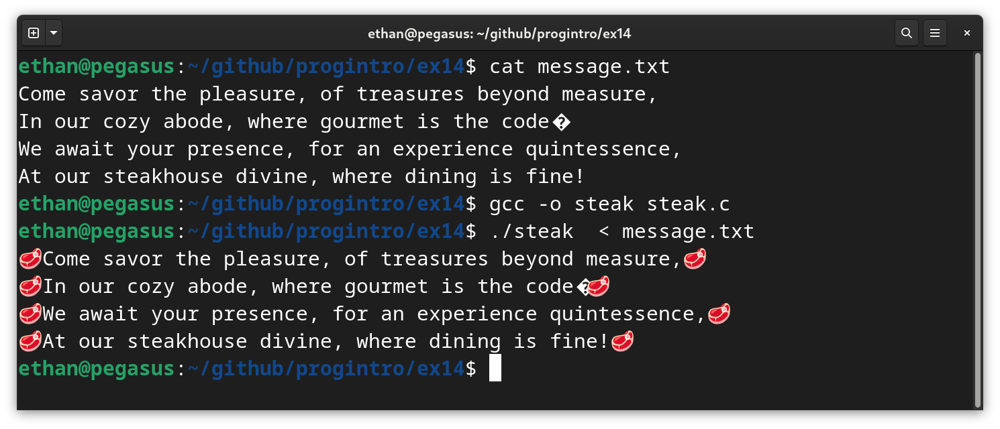

# Τελική Εξέταση #14 - Τσικνοπέμπτη :poultry_leg: Themed

Σημαντικό: φροντίζουμε τα προγράμματά μας να είναι ευανάγνωστα, αποδοτικά (σε χώρο και χρόνο) και να έχουν έξοδο όμοια με τα παραδείγματα εκτέλεσης καθώς αυτό είναι μέρος της βαθμολόγησης. Για οποιαδήποτε είσοδο εκτός προδιαγραφών το πρόγραμμα πρέπει να τερματίζει με exit code 1 και αντίστοιχο μήνυμα σφάλματος.

## 1. Ορεκτικό (25 Μονάδες)

### Πρόγραμμα: steak.c

Γράψτε ένα πρόγραμμα που διαβάζει από την πρότυπη είσοδο (stdin) ένα κείμενο και το τυπώνει στην πρότυπη έξοδο (stdout) αφού πρώτα προσθέσει μια μπριζόλα (χαρακτήρας unicode U+1F969)  στην αρχή και στο τέλος κάθε γραμμής. Το υπόλοιπο της πρότασης δεν πρέπει να αλλάζει. Το πρόγραμμά σας πρέπει να χειρίζεται γραμμές οποιουδήποτε μήκους. Παράδειγμα εκτέλεσης ακολουθεί:



## 2. Μένοντας στις Σωστές Θερμίδες (25 Μονάδες)

### Πρόγραμμα: right.c

Γράψτε ένα πρόγραμμα το οποίο δέχεται ως πρώτο όρισμα ένα σύνολο θερμίδων το οποίο δεν πρέπει να υπερβούμε και τα υπόλοιπα ορίσματα είναι οι θερμίδες που περιέχει κάθε πιάτο μπροστά μας και τυπώνει τον μέγιστο αριθμό πιάτων που μπορούμε να φάμε χωρίς να υπερβούμε το όριο θερμίδων. Οι θερμίδες μπορούν να είναι μόνο θετικοί ακέραιοι και κάθε όρισμα αντιστοιχεί σε ακριβώς ένα πιάτο μπροστά μας (δεν μπορούμε να φάμε το ίδιο πιάτο δύο φορές!). Παραδείγματα εκτέλεσης ακολουθούν:

```
$ gcc -o right right.c
$ ./right
Need a target set of calories
$ ./right 100 101
Within 100 calories we can fit 0 different plates
$ ./right 100 30 70 20 85 15 9 50
Within 100 calories we can fit 4 different plates
$ ./right 1000 29 37 982 3 38 3899 22 737 89 478 27892 787 2897
Within 1000 calories we can fit 7 different plates
```

## 3. Μετρήσεις Θερμοκρασίας (25 Μονάδες)

### Πρόγραμμα: templog.c

Γράψτε ένα πρόγραμμα το οποίο παίρνει ως όρισμα ένα αρχείο με μετρήσεις ενός θερμομέτρου στην διάρκεια του χρόνου το οποίο να τυπώνει στην πρότυπη έξοδο την μέση θερμοκρασία όλων των μετρήσεων και στην συνέχεια να τυπώνει όλες τις θερμοκρασίες ταξινομημένες με αύξουσα σειρά με βάση την απόστασή τους από την μέση θερμοκρασία. Το αρχείο με τις μετρήσεις θα έχει την μορφή "ώρα μέτρησης,θερμοκρασία" όπου η θερμοκρασία θα είναι ένας αριθμός κινητής υποδιαστολής. Η μέση θερμοκρασία θέλουμε να τυπωθεί με 3 δεκαδικά ψηφία. Παράδειγμα εκτέλεσης ακολουθεί:

```
$ cat log.txt
2024-03-07 10:18:27,205.00
2024-03-07 10:19:27,220.50
2024-03-07 10:20:27,221.00
2024-03-07 10:21:27,223.80
2024-03-07 10:22:27,229.32
2024-03-07 10:23:27,230.50
2024-03-07 10:24:27,223.00
2024-03-07 10:25:27,223.50
2024-03-07 10:26:27,220.75
2024-03-07 10:27:27,219.50
$ gcc -o templog templog.c
$ ./templog log.txt
Average temperature: 221.687
2024-03-07 10:20:27,221.00
2024-03-07 10:26:27,220.75
2024-03-07 10:19:27,220.50
2024-03-07 10:24:27,223.00
2024-03-07 10:25:27,223.50
2024-03-07 10:21:27,223.80
2024-03-07 10:27:27,219.50
2024-03-07 10:22:27,229.32
2024-03-07 10:23:27,230.50
2024-03-07 10:18:27,205.00
```

## 4. Τρόποι να Φάμε Παϊδάκια (25 Μονάδες)

### Πρόγραμμα: chops.c

Ο Θάνος μόλις παρήγγειλε Ν παϊδάκια (τουλάχιστον 3) και αναρωτιέται με πόσους διαφορετικούς τρόπους μπορεί να τα φάει. Ξέρει ότι με κάθε του μπουκιά μπορεί να φάει 1 ή 2 παϊδάκια. Επειδή πεινάει πολύ σκοπεύει να φάει 3 παϊδάκια με ακριβώς μία μπουκιά. Για παράδειγμα, αν του φέρουν 5 παϊδάκια, μπορεί να τα φάει με 5 τρόπους: 1-1-3 (1 με μια μπουκιά, 1 με μια μπουκιά, 3 με μια μπουκιά), 1-3-1, 3-1-1, 2-3 και 3-2. Αν του φέρουν 3 παϊδάκια υπάρχει ακριβώς ένας τρόπος (3 με την μία). Αν του φέρουν 4 υπάρχουν 2 τρόποι (1-3, 3-1). Γράψτε ένα πρόγραμμα το οποίο παίρνει τον αριθμό από τα παϊδάκια ως ακέραιο όρισμα και τυπώνει τον αριθμό των διαφορετικών τρόπων με τους οποίους ο Θάνος μπορεί να τα φάει όλα. Παραδείγματα εκτέλεσης ακολουθούν:

```
$ ./chops 2
I would never order less than 3 chops.
$ ./chops 3
There are 1 different ways to eat 3 chops.
$ ./chops 4
There are 2 different ways to eat 4 chops.
$ ./chops 5
There are 5 different ways to eat 5 chops.
$ ./chops 6
There are 10 different ways to eat 6 chops.
$ ./chops 50
There are 168903452400 different ways to eat 50 chops.
```
