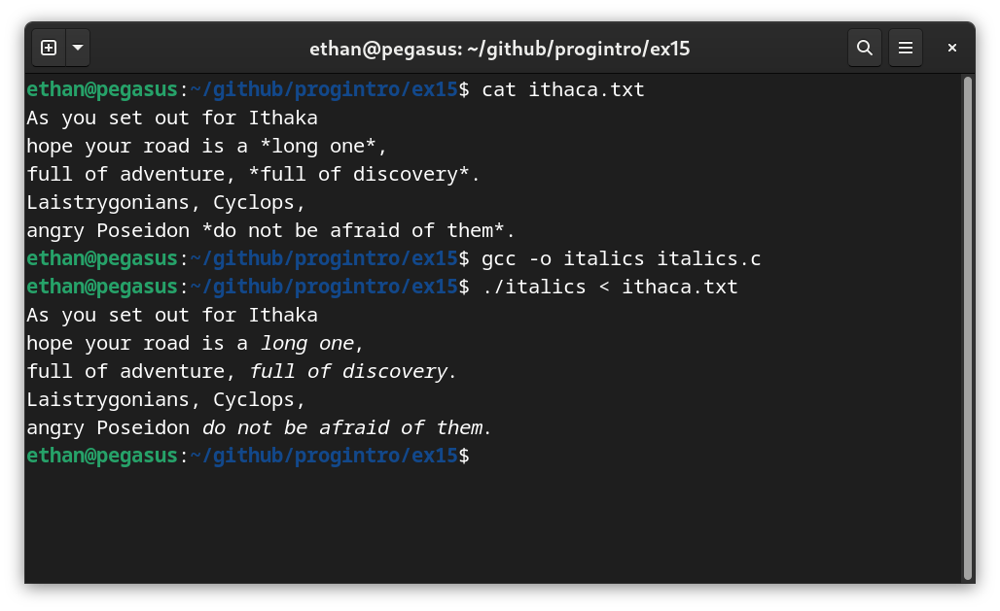
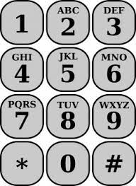

# Τελική Εξέταση #15 - Formats Themed

Σημαντικό: φροντίζουμε τα προγράμματά μας να είναι ευανάγνωστα, αποδοτικά (σε χώρο και χρόνο) και να έχουν έξοδο όμοια με τα παραδείγματα εκτέλεσης καθώς αυτό είναι μέρος της βαθμολόγησης. Για οποιαδήποτε είσοδο εκτός προδιαγραφών το πρόγραμμα πρέπει να τερματίζει με exit code 1 και αντίστοιχο μήνυμα σφάλματος.

## 1. Πλαγιαστά Γράμματα (25 Μονάδες)

### Πρόγραμμα: italics.c

Γράψτε ένα πρόγραμμα που διαβάζει από την πρότυπη είσοδο (stdin) ένα κείμενο και το τυπώνει στην πρότυπη έξοδο (stdout) αφού πρώτα μετατρέψει τα γράμματα εντός των αστερίσκων (*) σε πλαγιαστά γράμματα (italics). Τα γράμματα που βρίσκονται εκτός αστερίσκων δεν χρειάζεται να αλλαχθούν. Οι αστερίσκοι θα παραλείπονται στην έξοδο του προγράμματος. Παράδειγμα εκτέλεσης ακολουθεί:



## 2. Τυπώνοντας τον Πίνακα ASCII (25 Μονάδες)

### Πρόγραμμα: ascii.c

Γράψτε ένα πρόγραμμα το οποίο δέχεται ως πρώτο όρισμα τον αριθμό στηλών που θέλουμε να χρησιμοποιήσει για τον πίνακα ASCII και στην συνέχεια τυπώνει τον πίνακα στην πρότυπη έξοδο. Οι χαρακτήρες πρέπει να τυπώνονται με την σειρά ο ένας κάτω από τον άλλο μέχρι να περάσουμε στην επόμενη στήλη. Για κάθε χαρακτήρα πρέπει να τυπώνεται: "χαρακτήρας: δεκαεξαδική αναπαράσταση". Για παράδειγμα "Α: 41". Πρέπει να τυπωθούν όλοι οι χαρακτήρες στο εύρος [0-127]. Στην θέση των χαρακτήρων [0x08-0x0d] θέλουμε να τυπώνεται το 'x'. Παραδείγματα εκτέλεσης ακολουθούν:

```
$ gcc -o ascii ascii.c
$ ./ascii 5
	:	00 	:	19 	2:	32 	K:	4b 	d:	64 	}:	7d
	:	01 	�:	1a 	3:	33 	L:	4c 	e:	65 	~:	7e
	:	02 		1b 	4:	34 	M:	4d 	f:	66 	:	7f
	:	03 	:	1c 	5:	35 	N:	4e 	g:	67
	:	04 	:	1d 	6:	36 	O:	4f 	h:	68
	:	05 	:	1e 	7:	37 	P:	50 	i:	69
	:	06 	:	1f 	8:	38 	Q:	51 	j:	6a
	:	07 	 :	20 	9:	39 	R:	52 	k:	6b
	x:	08 	!:	21 	::	3a 	S:	53 	l:	6c
	x:	09 	":	22 	;:	3b 	T:	54 	m:	6d
	x:	0a 	#:	23 	<:	3c 	U:	55 	n:	6e
	x:	0b 	$:	24 	=:	3d 	V:	56 	o:	6f
	x:	0c 	%:	25 	>:	3e 	W:	57 	p:	70
	x:	0d 	&:	26 	?:	3f 	X:	58 	q:	71
	:	0e 	':	27 	@:	40 	Y:	59 	r:	72
	:	0f 	(:	28 	A:	41 	Z:	5a 	s:	73
	:	10 	):	29 	B:	42 	[:	5b 	t:	74
	:	11 	*:	2a 	C:	43 	\:	5c 	u:	75
	:	12 	+:	2b 	D:	44 	]:	5d 	v:	76
	:	13 	,:	2c 	E:	45 	^:	5e 	w:	77
	:	14 	-:	2d 	F:	46 	_:	5f 	x:	78
	:	15 	.:	2e 	G:	47 	`:	60 	y:	79
	:	16 	/:	2f 	H:	48 	a:	61 	z:	7a
	:	17 	0:	30 	I:	49 	b:	62 	{:	7b
	:	18 	1:	31 	J:	4a 	c:	63 	|:	7c
$ ./ascii 6
	:	00 	:	15 	*:	2a 	?:	3f 	T:	54 	i:	69 	~:	7e
	:	01 	:	16 	+:	2b 	@:	40 	U:	55 	j:	6a 	:	7f
	:	02 	:	17 	,:	2c 	A:	41 	V:	56 	k:	6b
	:	03 	:	18 	-:	2d 	B:	42 	W:	57 	l:	6c
	:	04 	:	19 	.:	2e 	C:	43 	X:	58 	m:	6d
	:	05 	�:	1a 	/:	2f 	D:	44 	Y:	59 	n:	6e
	:	06 		1b 	0:	30 	E:	45 	Z:	5a 	o:	6f
	:	07 	:	1c 	1:	31 	F:	46 	[:	5b 	p:	70
	x:	08 	:	1d 	2:	32 	G:	47 	\:	5c 	q:	71
	x:	09 	:	1e 	3:	33 	H:	48 	]:	5d 	r:	72
	x:	0a 	:	1f 	4:	34 	I:	49 	^:	5e 	s:	73
	x:	0b 	 :	20 	5:	35 	J:	4a 	_:	5f 	t:	74
	x:	0c 	!:	21 	6:	36 	K:	4b 	`:	60 	u:	75
	x:	0d 	":	22 	7:	37 	L:	4c 	a:	61 	v:	76
	:	0e 	#:	23 	8:	38 	M:	4d 	b:	62 	w:	77
	:	0f 	$:	24 	9:	39 	N:	4e 	c:	63 	x:	78
	:	10 	%:	25 	::	3a 	O:	4f 	d:	64 	y:	79
	:	11 	&:	26 	;:	3b 	P:	50 	e:	65 	z:	7a
	:	12 	':	27 	<:	3c 	Q:	51 	f:	66 	{:	7b
	:	13 	(:	28 	=:	3d 	R:	52 	g:	67 	|:	7c
	:	14 	):	29 	>:	3e 	S:	53 	h:	68 	}:	7d
```

## 3. Ταξινομώντας τα Άλματα (25 Μονάδες)

### Πρόγραμμα: longjump.c

Γράψτε ένα πρόγραμμα το οποίο παίρνει ως όρισμα ένα αρχείο με τα άλματα που έκανε κάθε αθλητής και εκτυπώνει τους αθλητές σε φθίνουσα σειρά με βάση τα άλματα που έκαναν. Το αρχείο θα είναι σε μορφή JSON, δηλαδή θα αρχίζει με τον χαρακτήρα '{' και θα τελειώνει με τον χαρακτήρα '}' και για κάθε όνομα αθλητή θα τυπώνει `"όνομα": μήκος` όπου το μήκος θα είναι ένας αριθμός κινητής υποδιαστολής. Ανάμεσα σε κάθε αθλητή-άλμα θα υπάρχει ο χαρακτήρας ','. Δεν επιτρέπεται χρήση εξωτερικών βιβλιοθηκών. Παράδειγμα εκτέλεσης ακολουθεί:

```
$ cat jumps.json
{
    "mcleod": 8.20,
    "furlani": 8.21,
    "montler": 7.80,
    "batz": 8.06,
    "williams": 7.83,
    "lawson": 8.05,
    "gayle": 7.89,
    "tentoglou": 8.22
}
$ gcc -o longjump longjump.c
$ ./longjump jumps.json
tentoglou: 8.22
furlani: 8.21
mcleod: 8.20
batz: 8.06
lawson: 8.05
gayle: 7.89
williams: 7.83
montler: 7.80
```

## 4. Δυνατότητες (25 Μονάδες)

### Πρόγραμμα: phone.c

Σε κάποια τηλέφωνα, ίσως έχετε παρατηρήσει πως ο κάθε αριθμός αντιστοιχεί σε συγκεκριμένα γράμματα:



(2 -> ABC, 3 -> DEF, ... κοκ). Λέγοντας έναν αριθμό, μπορείς να περιγράψεις ένα σύνολο από λέξεις και το αντίστροφο: μια λέξη προσδιορίζει έναν συγκεκριμένο αριθμό. Για παράδειγμα, η λέξη CAT προσδιορίζει το 228 (C -> 2, A -> 2, T -> 8). Γράψτε ένα πρόγραμμα, το οποίο παίρνει ως πρώτο όρισμα ένα αρχείο με λέξεις (μία ανά γραμμή) και έναν αριθμό ως το δεύτερο όρισμα και τυπώνει όλες τις λέξεις που μπορούν να εκφραστούν με αυτόν τον αριθμό. Οποιοδήποτε ψηφίο δεν ταιριάζει σε κάποιο γράμμα (0, 1) θεωρείται "μπαλαντέρ", δηλαδή ταιριάζει με οποιοδήποτε γράμμα. Παραδείγματα εκτέλεσης ακολουθούν:

```
$ gcc -o phone phone.c
$ ./phone words.txt
Usage: ./phone dictionary phone
$ cat words.txt
cat
dog
deep
purple
smoke
water
rain
spain
plain
$ ./phone words.txt 228
cat
$ ./phone words.txt 70000
smoke
spain
plain
$ ./phone words.txt 71246
spain
plain
$ ./phone /usr/share/dict/words 71246
Rabin
Robin
Rubin
Sabin
Spahn
Spain
plain
robin
slain
stain
swain
```
