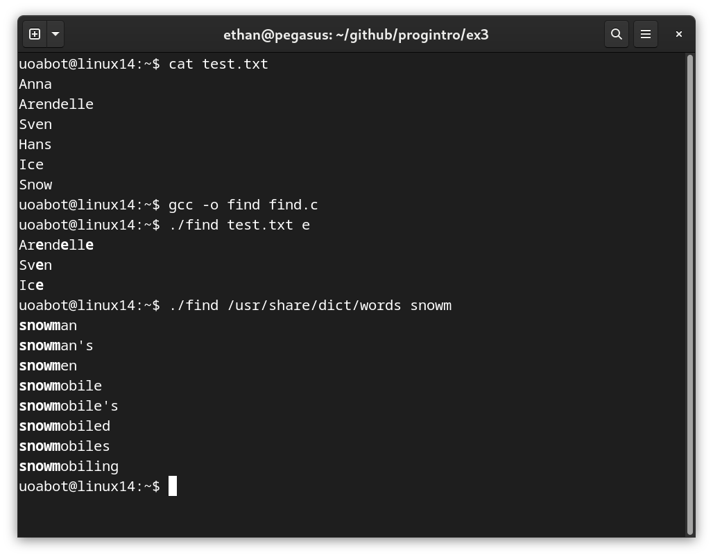
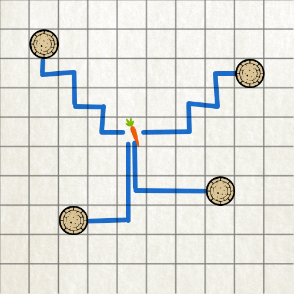

# Τελική Εξέταση #3 - Frozen Themed

Σημαντικό: φροντίζουμε τα προγράμματά μας να είναι ευανάγνωστα, αποδοτικά (σε χώρο και χρόνο) και να έχουν έξοδο όμοια με τα παραδείγματα εκτέλεσης καθώς αυτό είναι μέρος της βαθμολόγησης. Για οποιαδήποτε είσοδο εκτός προδιαγραφών το πρόγραμμα πρέπει να τερματίζει με exit code 1 και αντίστοιχο μήνυμα σφάλματος.


## 1. Προσθήκη Νιφάδων (25 Μονάδες)

### Πρόγραμμα: snow.c

Γράψτε ένα πρόγραμμα που διαβάζει το κείμενο που δίνεται από την πρότυπη είσοδο (stdin) και τυπώνει την κάθε λέξη χαρακτήρα στην πρότυπη έξοδο (stdout) εμπλουτισμένη με νιφάδες, δηλαδή με τον χαρακτήρα `*`. Νιφάδες μπαίνουν μόνο ανάμεσα στα γράμματα της κάθε λέξης. Λέξεις με μόνο ένα γράμμα δεν χρειάζονται κάποια προσθήκη. Οι λέξεις αποτελούνται από τα γράμματα A-Z και a-z. Αριθμοί ή σημεία στίξης *δεν* θεωρούνται λέξεις. Παράδειγμα εκτέλεσης:

```
$ cat elsa.txt
	Let it go, let it go�,
	Turn away and slam the door ,
	I don't care what they're going to say ,
	Let the storm rage on ,
	The cold never bothered me anyway !
$ gcc -o snow snow.c
$ ./snow < elsa.txt
	L*e*t i*t g*o, l*e*t i*t g*o�,
	T*u*r*n a*w*a*y a*n*d s*l*a*m t*h*e d*o*o*r ,
	I d*o*n't c*a*r*e w*h*a*t t*h*e*y'r*e g*o*i*n*g t*o s*a*y ,
	L*e*t t*h*e s*t*o*r*m r*a*g*e o*n ,
	T*h*e c*o*l*d n*e*v*e*r b*o*t*h*e*r*e*d m*e a*n*y*w*a*y !
```

## 2. Φορτωμένο Έλκηθρο (25 Μονάδες)

### Πρόγραμμα: sled.c

O Kristoff θέλει να πάρει τρία αντικείμενα μαζί του και να ελέγξει αν γεμίζουν πλήρως (από πλευράς βάρους) το έλκηθρό του. Γράψτε ένα πρόγραμμα που δέχεται ως πρώτο όρισμα την χωρητικότητα του ελκήθρου και στην συνέχεια το βάρος του κάθε αντικειμένου που θα μπορούσε να πάρει. Περιορισμοί: (1) τα βάρη είναι όλα ακέραιοι, (2) πρέπει να πάρει αναγκαστικά 3 αντικείμενα, (3) το κάθε αντικείμενο έχει μοναδικό βάρος και (4) τα βάρη πρέπει να γεμίζουν *πλήρως* το έλκηθρο. Παράδειγμα εκτέλεσης ακολουθεί:

```bash
$ ./sled 42 18 1 4 81 47 35 22 41 2 3 17
You can take 3 objects: 18 + 22 + 2 = 42
You can take 3 objects: 4 + 35 + 3 = 42
You can take 3 objects: 22 + 3 + 17 = 42
$ ./sled 42 18 1 4 81 47 35 41 2 17
No 3 objects found to fill up your sled.
```

## 3. Εύρεση Λέξεων (25 Μονάδες)

### Πρόγραμμα: find.c

Γράψτε ένα πρόγραμμα που παίρνει δύο ορίσματα: (1) το όνομα του αρχείου που περιέχει το σύνολο των λέξεων που έχουμε διαθέσιμες και (2) την υπακολουθία που ψάχνουμε μέσα σε αυτές τις λέξεις. Το πρόγραμμά μας πρέπει να τυπώνει όσες λέξεις περιέχουν την υπακολουθία  (για παράδειγμα το "snow" περιέχεται στο "snowman" αλλά δεν περιέχεται στο "noman") και το μέρος που ταιριάζει στην υπακολουθία πρέπει να τονιστεί με **bold** χαρακτήρες. Προσοχή: μια υπακολουθία μπορεί να υπάρχει περισσότερες από μία φορές σε μια λέξη. Παράδειγμα εκτέλεσης ακολουθεί:



## 4. Χτίζοντας έναν Χιονάνθρωπο (25 Μονάδες)

### Πρόγραμμα: olaf.c

Βρισκόμαστε σε έναν χιονισμένο τετράγωνο κήπο διαστάσεων ΝxN και Θέλουμε να φτιάξουμε έναν χιονάνθρωπο. Δυστυχώς το χιόνι είναι μαζεμένο σε συγκεκριμένους σωρούς μέσα στον κήπο (δεν είναι παντού). Γράψτε ένα πρόγραμμα που αποφασίζει που πρέπει να φτιάξουμε τον χιονάνθρωπό μας ώστε να κάνουμε τον ελάχιστο δυνατό κόπο. Για λόγους απλοποίησης θεωρούμε ότι όλες οι συντεταγμένες στον κήπο είναι ακέραιοι και ότι οι κινήσεις μας μπορούν να είναι μόνο πάνω-κάτω-αριστερά-δεξιά (όχι διαγώνια). Το μέγεθος του κήπου και οι τοποθεσίες των σωρών χιονιού δίνονται στο πρόγραμμα μέσω αρχείου του οποίου το όνομα θα είναι το πρώτο όρισμα του προγράμματος. Το αρχείο θα περιέχει την διάσταση του κήπου (Ν) ακολουθούμενη από τις συντεταγμένες του κάθε σωρού. Παράδειγμα επιτυχούς εκτέλεσης ακολουθεί:

```bash
$ gcc -o olaf olaf.c
$ cat map.txt
10
1 1
6 7
2 8
7 2
$ ./olaf map.txt
We will position the snowman on (4, 4) with a minimum cost of 22.
```

Παρακάτω βλέπουμε την οπτικοποίηση της επιλογής μας - ο χιονάνθρωπος βρίσκεται στην θέση "καρότο" ενώ οι σωροί με τα χιόνια απεικονίζονται με τους κύκλους. Από τους δύο πάνω σωρούς παρατηρούμε ότι χρειαζόμαστε 6 βήματα για να φτάσουμε τον χιονάνθρωπο ενώ από τους δύο κάτω χρειαζόμαστε 5 - σύνολο (6 + 6 + 5 + 5 =) 22. Παρατηρήστε ότι μπορεί να υπάρχουν πάνω από μία βέλτιστες τοποθετήσεις, χρειάζεται να βρούμε μόνο μία από αυτές. Για λόγους απλότητας ο χιονάνθρωπος μπορεί να τοποθετηθεί πάνω σε έναν σωρό (και τα βήματα που απαιτούνται σε αυτήν την περίπτωση είναι 0).


