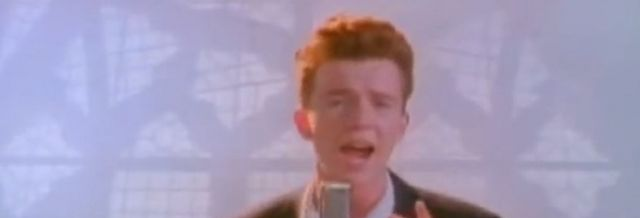

# Τελική Εξέταση #4 - Rick Astley Themed

Σημαντικό: φροντίζουμε τα προγράμματά μας να είναι ευανάγνωστα, αποδοτικά (σε χώρο και χρόνο) και να έχουν έξοδο όμοια με τα παραδείγματα εκτέλεσης καθώς αυτό είναι μέρος της βαθμολόγησης. Για οποιαδήποτε είσοδο εκτός προδιαγραφών το πρόγραμμα πρέπει να τερματίζει με exit code 1 και αντίστοιχο μήνυμα σφάλματος.

## 1. Αναγράμματα (25 Μονάδες)

### Πρόγραμμα: anagram.c

Γράψτε ένα πρόγραμμα που δέχεται δύο ορίσματα και ελέγχει αν το ένα είναι ένα ανάγραμμα του άλλου. Δύο φράσεις λέγονται αναγράμματα όταν περιέχουν τους ίδιους χαρακτήρες αλλά πιθανώς με διαφορετική σειρά π.χ., οι φράσεις "desert you" και "you rested" είναι αναγράμματα η μία της άλλης. Παράδειγμα εκτέλεσης:

```
$ gcc -o anagram anagram.c
$ ./anagram "desert you!" "you rested!"
"desert you!" is an anagram of "you rested!".
$ ./anagram "never gonna give" "never gonna give"
"never gonna give" is an anagram of "never gonna give".
$ ./anagram "never gonna give" "gonna run around"
"never gonna give" is NOT an anagram of "gonna run around".
```

## 2. Τα Πάνω Κάτω (25 Μονάδες)

### Πρόγραμμα: updown.c

Γράψτε ένα πρόγραμμα που διαβάζει το κείμενο που δίνεται από την πρότυπη είσοδο (stdin) και τυπώνει την κάθε λέξη χαρακτήρα στην πρότυπη έξοδο (stdout) έχοντας κάνει την εξής αντικατάσταση: κάθε λέξη "up" πρέπει να αντικατασταθεί με την λέξη "down" και κάθε "down" πρέπει να αντικατασταθεί με την λέξη "up". Οι λέξεις χωρίζονται με κενά (whitespace). Η αντικατάσταση πρέπει να γίνεται σε ολόκληρες λέξεις, όχι μέρος τους. Παράδειγμα εκτέλεσης:

```
$ cat rick.txt
upload and download this �:
never gonna give you up ,
never gonna let you down ,
never gonna run around and desert you !
$ gcc -o updown updown.c
$ ./updown < rick.txt
upload and download this �:
never gonna give you down ,
never gonna let you up ,
never gonna run around and desert you !
```

## 3. Rickroll Τριπλέτες (25 Μονάδες)

### Πρόγραμμα: roll.c

Γράψτε ένα πρόγραμμα που παίρνει 3 αριθμούς ως ορίσματα (σε αναπαράσταση μη προσημασμένου 32-bit αριθμού) και ελέγχει αν είναι είναι μια rickroll τριπλέτα. Τρεις αριθμοί a, b και c λέγονται rickroll τριπλέτα εάν υπάρχουν ακέραιοι I, J, K (διαφορετικοί ο ένας από τον άλλον I <> J <> K) έτσι ώστε 2^I * a + 2^J * b = 2^K * c - όπου όλες οι πράξεις είναι μη προσημασμένες mod 2^32. Παραδείγματα εκτέλεσης ακολουθούν:

```
$ gcc -o roll roll.c
$ ./roll 17 42 101
Found rick-roll triplet: 2^30 * 17 + 2^25 * 42 = 2^26 * 101 = 2483027968
Found rick-roll triplet: 2^30 * 17 + 2^29 * 42 = 2^31 * 101 = 2147483648
Found rick-roll triplet: 2^31 * 17 + 2^26 * 42 = 2^27 * 101 = 671088640
$ ./roll 17 42 100
Found rick-roll triplet: 2^27 * 17 + 2^29 * 42 = 2^25 * 100 = 3355443200
Found rick-roll triplet: 2^28 * 17 + 2^25 * 42 = 2^24 * 100 = 1677721600
Found rick-roll triplet: 2^28 * 17 + 2^30 * 42 = 2^26 * 100 = 2415919104
Found rick-roll triplet: 2^29 * 17 + 2^26 * 42 = 2^25 * 100 = 3355443200
Found rick-roll triplet: 2^29 * 17 + 2^31 * 42 = 2^27 * 100 = 536870912
Found rick-roll triplet: 2^30 * 17 + 2^27 * 42 = 2^26 * 100 = 2415919104
Found rick-roll triplet: 2^30 * 17 + 2^31 * 42 = 2^28 * 100 = 1073741824
Found rick-roll triplet: 2^31 * 17 + 2^28 * 42 = 2^27 * 100 = 536870912
$ ./roll 3 5 7
No rick-roll triplets found.
$ ./roll 0 0 1
No rick-roll triplets found.
```


## 4. Αλλαγή Μεγέθους (25 Μονάδες)

### Πρόγραμμα: crop.c

Γράψτε ένα πρόγραμμα το οποίο παίρνει 3 ορίσματα: (1) το όνομα ενός αρχείου, (2) την τοποθεσία (offset) σε αριθμό bytes μέσα στο αρχείο και (3) έναν αριθμό των δύο bytes (short) και τυπώνει στην πρότυπη έξοδο (stdout) το περιεχόμενο του αρχείου με τα δύο bytes στην τοποθεσία που αναφέρθηκε να έχουν αντικατασταθεί από τα bytes του αριθμού που δόθηκε από την γραμμή εντολών (όρισμα 3). Το υπόλοιπο αρχείο δεν πρέπει να αλλαχθεί. Τα αρχεία που θα δοθούν θα είναι μέχρι 100ΜΒ. Η εκτέλεση `./crop file 2 13362` σημαίνει διάβασε το αρχείο `file` και στο byte στην θέση `2` τοποθέτησε τα δύο bytes του αριθμού `13362`. Παραδείγματα εκτέλεσης ακολουθούν:

```
$ gcc -o crop crop.c
$ echo example > file
$ hexdump -C file
00000000  65 78 61 6d 70 6c 65 0a                           |example.|
00000008
$ ./crop file 2 13362 > file2
$ hexdump -C file2
00000000  65 78 34 32 70 6c 65 0a                           |ex42ple.|
00000008
$ file rick.jpg
rick.jpg: JPEG image data, JFIF standard 1.01, resolution (DPI), density 96x96, segment length 16, comment: "CREATOR: gd-jpeg v1.0 (using IJG JPEG v62), quality = 80", baseline, precision 8, 640x436, components 3
$ ./crop rick.jpg 224 218 > rick2.jpg
$ file rick2.jpg
rick2.jpg: JPEG image data, JFIF standard 1.01, resolution (DPI), density 96x96, segment length 16, comment: "CREATOR: gd-jpeg v1.0 (using IJG JPEG v62), quality = 80", baseline, precision 8, 640x218, components 3

```
Παρακάτω δείχνουμε το αποτέλεσμα της εκτέλεσης στην εικόνα rick.jpg (πριν):


Και μετά:




