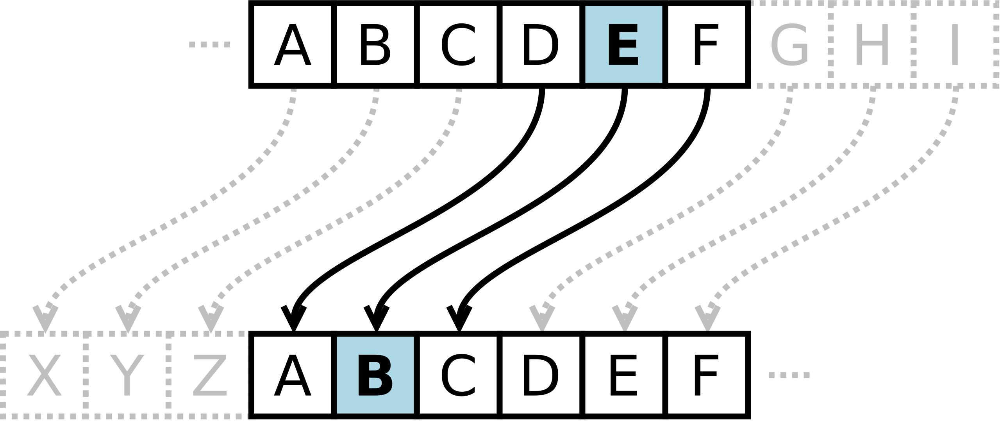

# Τελική Εξέταση #6 - Crypto Themed

Σημαντικό: φροντίζουμε τα προγράμματά μας να είναι ευανάγνωστα, αποδοτικά (σε χώρο και χρόνο) και να έχουν έξοδο όμοια με τα παραδείγματα εκτέλεσης καθώς αυτό είναι μέρος της βαθμολόγησης. Για οποιαδήποτε είσοδο εκτός προδιαγραφών το πρόγραμμα πρέπει να τερματίζει με exit code 1 και αντίστοιχο μήνυμα σφάλματος.


## 1. Μέγιστος Κοινός Διαιρέτης (25 Μονάδες)

### Πρόγραμμα: gcd.c

Μέγιστος κοινός διαιρέτης ονομάζεται ο μεγαλύτερος ακέραιος που διαιρεί δύο ή περισσότερους ακέραιους αριθμούς. Για παράδειγμα ο μέγιστος κοινός διαιρέτης του 42 και του 27 είναι το 3 (καθώς διαιρεί ακριβώς και το 42/3=14 και το 27/3=9). Γράψτε ένα πρόγραμμα που διαβάζει δύο θετικούς ακεραίους σε δεκαδική μορφή από την γραμμή εντολών και τυπώνει τον μέγιστο κοινό διαιρέτη. Παραδείγματα εκτέλεσης ακολουθούν:

```
$ gcc -o gcd gcd.c
$ ./gcd 42 27
Greatest common divisor of 42 and 27 is 3
$ ./gcd 42 -27
Numbers must be positive
$ ./gcd 54 24
Greatest common divisor of 54 and 24 is 6
$ ./gcd 9827345 9182767
Greatest common divisor of 9827345 and 9182767 is 11
$ ./gcd 782936492674398272 982137984792892
Greatest common divisor of 782936492674398272 and 982137984792892 is 4
$ ./gcd 260056890954482 23809214813964
Greatest common divisor of 260056890954482 and 23809214813964 is 2982734
```

## 2. Μήνυμα από τον Καίσαρα (25 Μονάδες)

### Πρόγραμμα: caesar.c

Υπάρχει ένας τρόπος κρυπτογράφησης που αποδίδεται στον Καίσαρα (Caesar Cipher) όπου κάθε γράμμα της αλφαβήτου αντιστοιχίζεται σε ένα άλλο. Για παράδειγμα με μετάθεση γραμμάτων κατά 3 παίρνουμε την ακόλουθη αντιστοίχιση:




Όπου το A αντιστοιχεί στο Z, το D στο A, κοκ. Γράψτε ένα πρόγραμμα που διαβάζει το κείμενο που δίνεται από την πρότυπη είσοδο (stdin) και το τυπώνει στην πρότυπη έξοδο (stdout) αφού το περάσει από κρυπτογράφηση με την μέθοδο του Καίσαρα όπου η μετατόπιση είναι 13, δηλαδή το A αντιστοιχεί στο N, το B αντιστοιχεί στο O κοκ. Το πρόγραμμα πρέπει να αντικαθιστά μόνο λατινικούς χαρακτήρες (A-Z, a-z) και όλοι οι υπόλοιποι πρέπει να μένουν ίδιοι. Παράδειγμα εκτέλεσης:

```
$ gcc -o caesar caesar.c
$ cat toto.txt
Vg'f tbaan gnxr n ybg gb qent zr njnl sebz lbh� ,
Gurer'f abguvat gung n uhaqerq zra be zber pbhyq rire qb ,
V oyrff gur envaf qbja va Nsevpn ,
Tbaan gnxr fbzr gvzr gb qb gur guvatf jr arire unq !
$ ./caesar < toto.txt
It's gonna take a lot to drag me away from you� ,
There's nothing that a hundred men or more could ever do ,
I bless the rains down in Africa ,
Gonna take some time to do the things we never had !
```

## 3. Σπάσε το PIN (25 Μονάδες)

### Πρόγραμμα: pin.c

Το αρχείο pin.c προσομοιάζει τον έλεγχο ενός συστήματος που ελέγχει αν το pin σου είναι σωστό και αν επιτρέπεται η πρόσβαση. Βρείτε το pin και προσθέστε το στο πρόγραμμα προκειμένου να τυπώσει "Access granted". Δεν επιτρέπεται να αλλάξετε τις ρουτίνες υπολογισμού της ορθότητας του pin αλλά μπορείτε να κάνετε όποιες άλλες δοκιμές / αλλαγές θέλετε. Γνωρίζουμε ότι ο pin είναι τετραψήφιος. Βεβαιωθείτε ότι καταγράψατε στο αρχείο όλον τον κώδικα που γράψατε για να βρείτε το pin. Παράδειγμα επιτυχούς εκτέλεσης ακολουθεί:

```
$ gcc -o pin pin.c
$ ./pin
Access granted
```

## 4. Ταξινόμηση Αρχείων Καταγραφής (25 Μονάδες)

### Πρόγραμμα: sortlog.c

Γράψτε ένα πρόγραμμα το οποίο παίρνει ως όρισμα το όνομα ενός αρχείου που περιέχει δεδομένα από αρχεία καταγραφής (logs) και τυπώνει όλα τα μηνύματα ταξινομημένα με βαση την ημερομηνία καταγραφής σε αύξουσα σειρά (δηλαδή πρώτα οι ημερομηνίες που είναι νωρίτερα). Κάθε γραμμή καταγραφής έχει την μορφή ημερομηνίας με ακρίβεια λεπτού (μορφής "χρόνος-μήνας-ημέρα Τ ώρες:λεπτά") ακολουθούμενη από `:` και μετά το μήνυμα της καταγραφής. Παράδειγμα επιτυχούς εκτέλεσης ακολουθεί:

```
$ gcc -o sortlog sortlog.c
$ cat logs.txt
2024-03-02T13:20: Info: New user 'developer' created successfully.
2000-07-18T07:00: System startup sequence completed successfully.
2024-12-12T11:25: 'admin' initiated system reboot after security patch application.
2024-11-07T08:15: Scheduled backup started for database 'TestDB'.
2024-12-01T09:00: System startup sequence initiated.
2024-03-15T05:45: System shutdown sequence initiated.
2024-03-02T10:30: User 'admin' logged in from IP address 192.168.1.105.
2024-02-05T16:30: Warning: Disk usage exceeds 85% on drive C:.
2004-03-09T21:00: Error: Network timeout while connecting to server 'backup.example.com'.
2025-03-04T14:45: Database connection established successfully.
$ ./sortlog logs.txt
2000-07-18T07:00: System startup sequence completed successfully.
2004-03-09T21:00: Error: Network timeout while connecting to server 'backup.example.com'.
2024-02-05T16:30: Warning: Disk usage exceeds 85% on drive C:.
2024-03-02T10:30: User 'admin' logged in from IP address 192.168.1.105.
2024-03-02T13:20: Info: New user 'developer' created successfully.
2024-03-15T05:45: System shutdown sequence initiated.
2024-11-07T08:15: Scheduled backup started for database 'TestDB'.
2024-12-01T09:00: System startup sequence initiated.
2024-12-12T11:25: 'admin' initiated system reboot after security patch application.
2025-03-04T14:45: Database connection established successfully.
```


