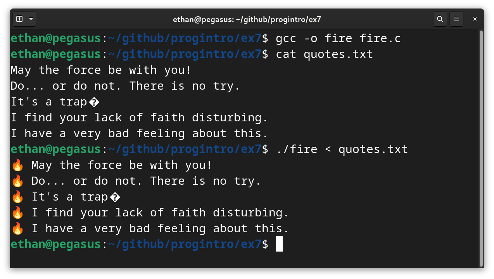

# Τελική Εξέταση #7 - Star Wars Themed

Σημαντικό: φροντίζουμε τα προγράμματά μας να είναι ευανάγνωστα, αποδοτικά (σε χώρο και χρόνο) και να έχουν έξοδο όμοια με τα παραδείγματα εκτέλεσης καθώς αυτό είναι μέρος της βαθμολόγησης. Για οποιαδήποτε είσοδο εκτός προδιαγραφών το πρόγραμμα πρέπει να τερματίζει με exit code 1 και αντίστοιχο μήνυμα σφάλματος.


## 1. Ανάβεις Φωτιές (25 Μονάδες)

### Πρόγραμμα: fire.c

Γράψτε ένα πρόγραμμα που διαβάζει από την πρότυπη είσοδο (stdin) ένα κείμενο και το τυπώνει στην πρότυπη έξοδο (stdout) αφού πρώτα προσθέσει μια φωτιά :fire: (χαρακτήρας unicode U+1F525) ακολουθούμενη από κενό στην αρχή κάθε γραμμής. Το υπόλοιπο της πρότασης δεν πρέπει να αλλάζει. Το πρόγραμμά σας πρέπει να χειρίζεται γραμμές οποιουδήποτε μήκους. Παράδειγμα εκτέλεσης ακολουθεί:



## 2. Κρυφό Μήνυμα (25 Μονάδες)

### Πρόγραμμα: r2d2.c

Γράψτε ένα πρόγραμμα που παίρνει ως ορίσματα δύο ονόματα αρχείων και στην συνέχεια τυπώνει το xor των bytes των δύο αρχείων. Για κάθε byte του πρώτου αρχείου a0, a1, a2 και κάθε byte του δεύτερου αρχείου b0, b1, b2 το πρόγραμμά σας θα πρέπει να τυπώνει τα bytes `a0 xor b0`, `a1 xor b1`, `a2 xor b2`. Παράδειγμα εκτέλεσης ακολουθεί:

```
$ gcc -o r2d2 r2d2.c
$ hexdump -C message.txt
00000000  3b 04 9f da fe db 32 10  28 6a b7 2c c0 a8 bb ee  |;.....2.(j.,....|
00000010  12 fa 32 1a 3e c7 a8 ec  dd 56 a7 11 c7 e0 07 95  |..2.>....V......|
00000020  1c 1d ff 4f 7d ee 25 48  8e 54 0e 39 3f 3c 61 db  |...O}.%H.T.9?<a.|
00000030  fa 5d 29 7c 6d a4 10 c2  4d 4f 97 6b 81 94 84 4b  |.])|m...MO.k...K|
00000040  5a 0e cb b7 9d 15 f9 86  46 e4 24 8c 4f b0 25 bb  |Z.......F.$.O.%.|
00000050  d0 cb d3 73 b9 0a ca 85  30 f2 d9 86 03 79 bd 56  |...s....0....y.V|
00000060  ca 0d 4d 06 42 fc aa 9c  d2 be 95 56 57 a3 74 a1  |..M.B......VW.t.|
00000070  39 74 0c b0 c1 d8 78 ab  7f c8 58 e0 50 66 b8 8a  |9t....x...X.Pf..|
00000080  ba 58 e4 88 b2 6d fb e9  ec a3 ce 7a b3 de 81 82  |.X...m.....z....|
00000090  8e b0 17 35 24 06 0b 8b  13 f4 2a 9e 66 5c 0d 2e  |...5$.....*.f\..|
000000a0  9c 62 94 02 f0 79 47 b7  1f e6 20 51 3b ad ca d5  |.b...yG... Q;...|
000000b0  64 37 44 07 0c d1 7d 06  9b db 91 1f a4 b2 b3 93  |d7D...}.........|
000000c0  ed 66 f4 49 01 bd 6a 30  73 18 44 00 84 c3 5e 8a  |.f.I..j0s.D...^.|
000000d0  9d 5e b4 93 14 df 79 f6  bc da 43 90 49 35 cf ad  |.^....y...C.I5..|
000000e0  95 61 64 5c 29 58 99 eb  8f 30 d7 c9 f1 79 82 ed  |.ad\)X...0...y..|
000000f0  b3 d2 e7 42 13 94 76 77  cf f9 78 64 01 44 a7 42  |...B..vw..xd.D.B|
00000100  82 c9 62 6a 6e 61 e9 00  9e 08 d1 e5 7e c7 1a 49  |..bjna......~..I|
00000110  23 5e 5c 40 d8 4f 44 dc  8c 82 d1 05 da 51 11 e6  |#^\@.OD......Q..|
00000120  60 ea 39 7c fa 6b ea 04  15 6a c6 90 ca b2 6a b3  |`.9|.k...j....j.|
00000130  f7 c8 69 5a e3 d3 ae cd  d3 60 a1 21 a5 ed 87 94  |..iZ.....`.!....|
00000140  2d cd fe 38 24                                    |-..8$|
00000145
$ hexdump -C key.txt
00000000  68 70 ed b3 95 b2 5c 77  08 0c c5 43 ad 88 da ce  |hp....\w...C....|
00000010  74 95 40 6e 4c a2 db 9f  fd 3e ce 75 a3 85 69 b5  |t.@nL....>.u..i.|
00000020  7d 70 90 21 1a ce 51 20  eb 74 6c 50 53 50 08 b4  |}p.!..Q .tlPSP..|
00000030  94 7d 5a 08 0c d6 63 e2  22 29 b7 1f e9 f1 a4 2c  |.}Z...c.").....,|
00000040  3b 62 aa cf e4 39 d9 f4  23 86 41 e0 6f c3 55 da  |;b...9..#.A.o.U.|
00000050  b3 ae a0 1b d0 7a b9 a5  58 93 af e3 23 0e d2 38  |.....z..X...#..8|
00000060  ea 79 25 63 2b 8e 8a fa  bb cc e6 22 77 d5 1d c2  |.y%c+......"w...|
00000070  4d 1b 7e c9 e1 b1 16 8b  1e e8 3a 81 24 12 d4 ef  |M.~.......:.$...|
00000080  9a 2f 8d fc da 4d 8f 81  89 83 be 15 c4 bb f3 e4  |./...M..........|
00000090  fb dc 37 7c 49 76 6e f9  7a 95 46 be 35 28 6c 5c  |..7|Ivn.z.F.5(l\|
000000a0  fa 0e f1 67 84 57 67 e3  77 83 00 14 76 fd 83 87  |...g.Wg.w...v...|
000000b0  21 17 22 62 6d a3 0e 26  ef b3 f0 6b 84 d3 dd fc  |!."bm..&...k....|
000000c0  99 0e 91 3b 21 d9 0f 56  16 79 30 20 e7 ac 2b e6  |...;!..V.y0 ..+.|
000000d0  f9 7e d6 e1 7d b1 1e d6  dd fa 37 f8 26 40 bc cc  |.~..}.....7.&@..|
000000e0  fb 05 44 31 46 2a fc cb  fc 5f bb a8 83 59 f1 94  |..D1F*..._...Y..|
000000f0  c0 a6 82 2f 60 b4 1f 19  bb 96 58 10 69 21 87 30  |.../`.....X.i!.0|
00000100  e7 ab 07 06 02 08 86 6e  b2 28 b0 8b 1a e7 53 24  |.......n.(....S$|
00000110  53 3b 2e 29 b9 23 64 bf  e3 ec a5 77 b5 3d 31 89  |S;.).#d....w.=1.|
00000120  16 8f 4b 5c 8e 03 8f 24  72 0b aa f1 b2 cb 4a c4  |..K\...$r.....J.|
00000130  98 bd 05 3e c3 b1 cb ed  bf 0f d2 55 85 8b e8 e6  |...>.......U....|
00000140  48 bb 9b 4a 0a                                    |H..J.|
00000145
$ ./r2d2 message.txt key.txt
Striking from a fortress hidden among the billion stars of the galaxy, rebel spaceships have won their first victory in a battle with the powerful Imperial Starfleet. The EMPIRE fears that another defeat could bring a thousand more solar systems into the rebellion, and Imperial control over the galaxy would be lost forever.
```

Παρατηρήστε ότι το a0 είναι 0x3b και το b0 είναι 0x68 και το 0x3b xor 0x68 κάνει 0x53 ('S'). Το υπόλοιπο μήνυμα προκύπτει με αντίστοιχο τρόπο.

## 3. Δίδυμοι Πρώτοι (25 Μονάδες)

### Πρόγραμμα: leia.c

Γράψτε ένα πρόγραμμα που παίρνει ένα εύρος θετικών ακεραίων ως ορίσματα από την κονσόλα (το εύρος είναι κλειστό, δηλαδή περιέχει τα όρια) και τυπώνει πόσα ζεύγη *δίδυμων πρώτων* (twin primes) υπάρχουν σε αυτό το διάστημα. Ένα ζεύγος ακεραίων (n, n+2) είναι δίδυμοι πρώτοι αν και ο n και ο n+2 είναι πρώτοι. Για παράδειγμα, στο διάστημα [1, 10] υπάρχουν μόλις δύο ζεύγη δίδυμων πρώτων (3, 5) και (5, 7). Παραδείγματα εκτέλεσης ακολουθούν:

```
$ gcc -o leia leia.c
$ ./leia 1 10
2
$ ./leia 10 100
6
$ ./leia 1 10000000
58980
$ ./leia 100000000000 100000100000
182
```

## 4. Κόψιμο Αρχείων (25 Μονάδες)

### Πρόγραμμα: cut.c

Γράψτε ένα πρόγραμμα το οποίο παίρνει ως όρισμα το όνομα ενός αρχείου που περιέχει δεδομένα και έναν ακέραιο αριθμό από bytes τα οποία θέλουμε να κόψουμε από το τέλος του αρχείου και τυπώνει το νέο αρχείο - έχοντας "κόψει" αυτά τα bytes - στην πρότυπη έξοδο. Τα αρχεία θα είναι μέχρι 100MB. Παράδειγμα επιτυχούς εκτέλεσης ακολουθεί:

```
$ gcc -o cut cut.c
$ echo hello world > msg.txt
$ hexdump -C msg.txt
00000000  68 65 6c 6c 6f 20 77 6f  72 6c 64 0a              |hello world.|
0000000c
$ ./cut msg.txt 6 > msg-cut.txt
$ hexdump -C msg-cut.txt
00000000  68 65 6c 6c 6f 20                                 |hello |
00000006
$ wc -c imperial.mp3
2846267 imperial.mp3
$ ./cut imperial.mp3 2256267 > imperial-cut.mp3
$ wc -c imperial-cut.mp3
590000 imperial-cut.mp3
```


